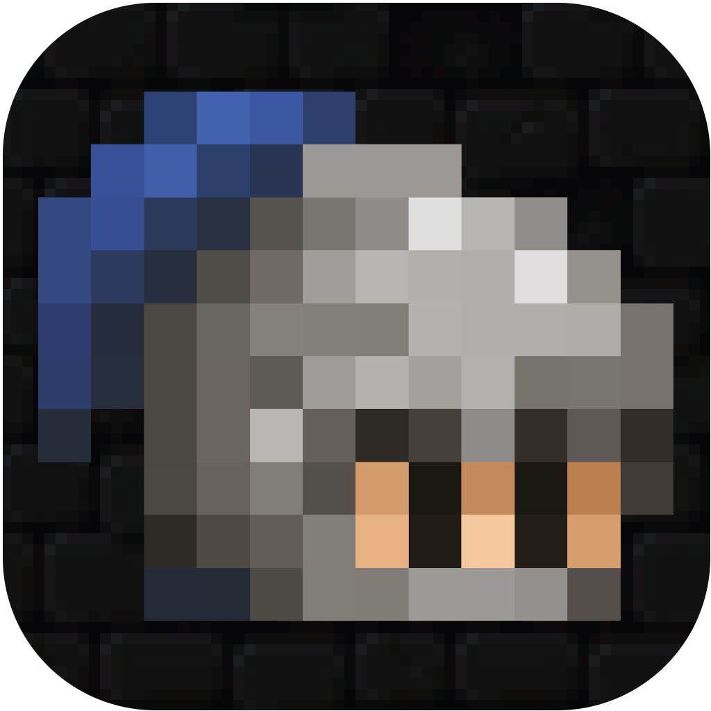
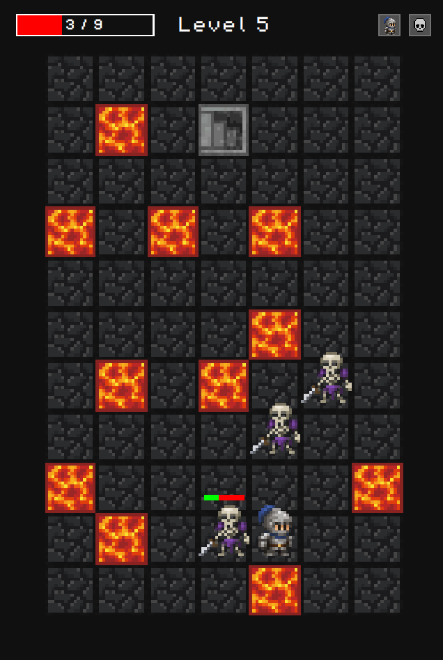

  

<h1 align="center">DungeonKnight</h1>

A pixel art dungeon crawler roguelike where you fight enemies in turn-based combat as you descend through dangerous dungeon levels.
Along the way, you choose your own blessings and curses, shaping each run to your playstyle.

## Features
- Turn based Combat
- self-selected buffs and debuffs
- roguelike

## Tech Stack
- Felgo / Qt Creator
- Qt / QML (Javascript)
- C++
- Cmake

## Tutorial
- a step by step tutorial how to create this game yourself is located
[here](Tutorial/html/index.html)
